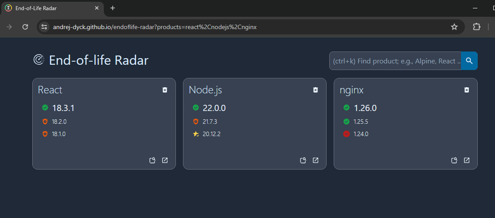

# End-of-Life Radar


An end-of-life radar for your projects using [endoflife.date](https://endoflife.date/).

Demo here [https://andrej-dyck.github.io/endoflife-radar/](https://andrej-dyck.github.io/endoflife-radar/).


It runs locally in your browser and persists state (e.g., which products you chose to show on the dashboard) in the URL.

To deploy the dashboard, e.g., can simply serve the content of the `./dist` folder (created by `pnpm build`) in an NGINX. Then, bookmark the URL of a configured dashboard.

## Development

Install dependencies with [pnpm](https://pnpm.io/)
```bash
pnpm i --frozen-lockfile
```

Run development environment
```bash
pnpm dev
```

Run preview build
```bash
pnpm preview
```

### Test & Lint

Run tests.
```bash
pnpm test
```

Run linter.
```bash
pnpm lint
```

### Production Build

```bash
pnpm build
```
