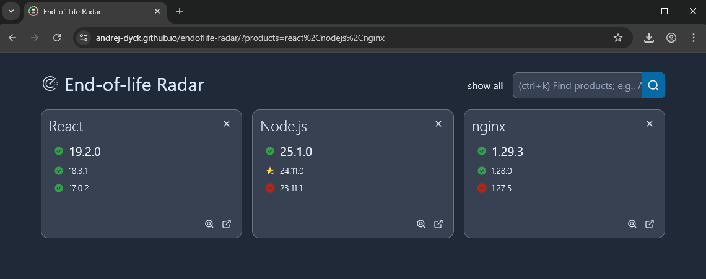

# End-of-Life Radar

[](https://github.com/andrej-dyck/endoflife-radar/actions/workflows/ci.yml)
[](https://github.com/andrej-dyck/endoflife-radar/actions/workflows/deploy-gh-pages.yml)
[](https://github.com/andrej-dyck/endoflife-radar/actions/workflows/github-code-scanning/codeql)

An end-of-life radar for your projects using [endoflife.date](https://endoflife.date/).

Demo here [https://andrej-dyck.github.io/endoflife-radar/](https://andrej-dyck.github.io/endoflife-radar/).



It runs locally in your browser and persists state (e.g., which products you chose to show on the dashboard) in the URL.

To deploy the dashboard, serve the content of the `./dist` folder (cf. *production build*) with, for example, NGINX.

Bookmark the URL of a configured dashboard and share it with your teammates.

## Development

Install dependencies with [pnpm](https://pnpm.io/)
```bash
pnpm i
```

Run development environment
```bash
pnpm dev
```

Run typecheck, lint, and tests (unit and integration).
```bash
pnpm check
```

## EoL-products API Snapshot for CI Tests

The integration test of the [end-of-life API](https://endoflife.date/docs/api/v1/) cannot run in CI, as it will be rate-limited and blocked.
So, to run the integration test in CI, a snapshot of all products is used.

Update the snapshot with
```bash
curl https://endoflife.date/api/v1/products/full > ./src/test-data/eol-full-products.snapshot.json
```

## Production Build

Build the app for production (output to `./dist`).
```bash
pnpm build
```
