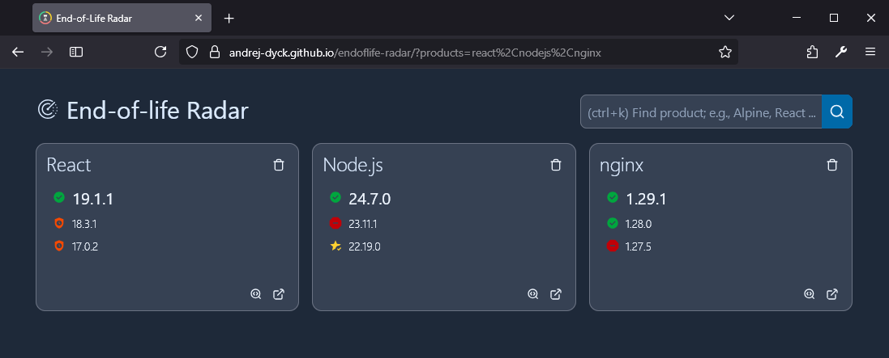

# End-of-Life Radar


An end-of-life radar for your projects using [endoflife.date](https://endoflife.date/).

Demo here [https://andrej-dyck.github.io/endoflife-radar/](https://andrej-dyck.github.io/endoflife-radar/).



It runs locally in your browser and persists state (e.g., which products you chose to show on the dashboard) in the URL.

To deploy the dashboard, serve the content of the `./dist` folder (cf. *production build*) with, for example, NGINX.

Bookmark the URL of a configured dashboard and share it with your teammates.

## Development

Install dependencies with [pnpm](https://pnpm.io/)
```bash
pnpm i
```

Run development environment
```bash
pnpm dev
```

Run typecheck, lint, and tests (unit and integration).
```bash
pnpm check
```

## Production Build

Build the app for production (output to `./dist`).
```bash
pnpm build
```
